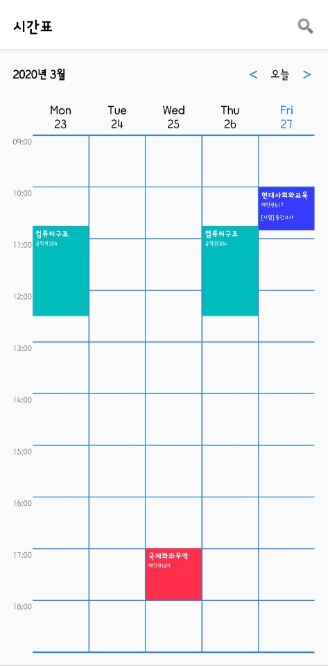
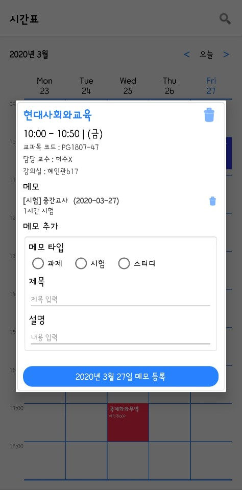
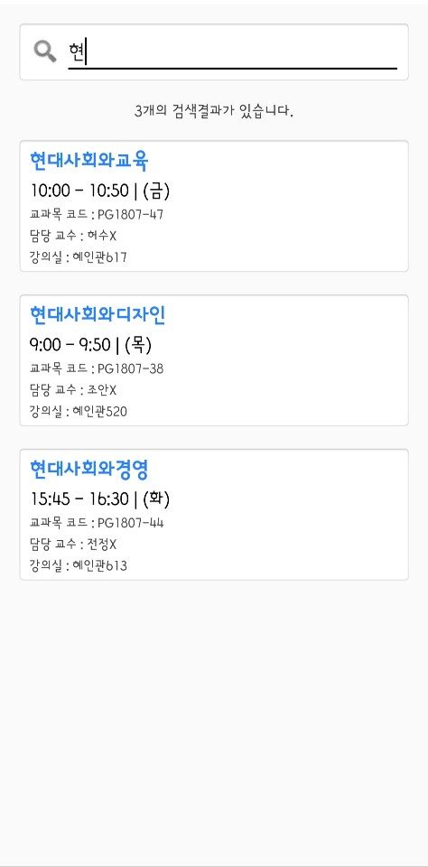
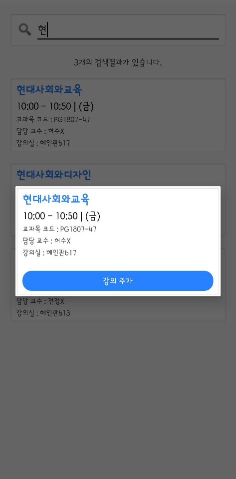

# TimeTableApp

Created: 2019-11-04

Last Updated: 2019-11-04

## Screenshot

   

## Description

You can search for the desired subject and add it to the timetable.

You can add a memo to the desired subject.

## Skills

* AsyncTask (deprecated)
* JsonParser
